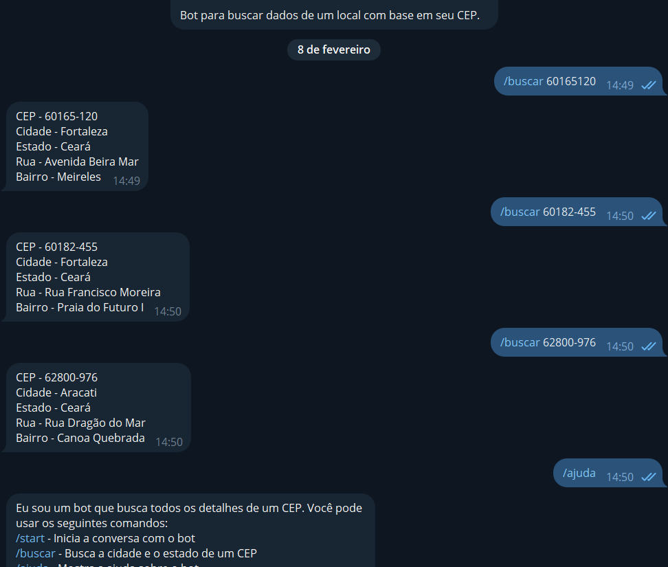
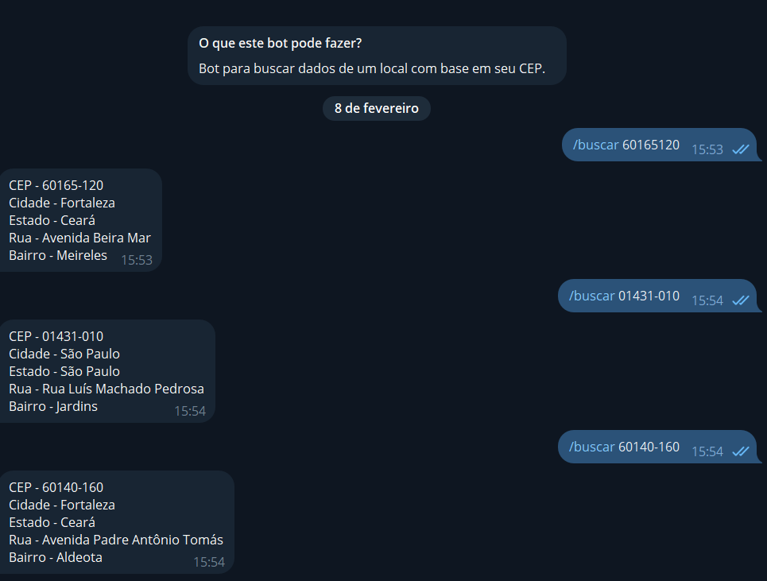

# Consulta de Detalhes de CEP 📬

Este é um projeto simples que permite consultar os detalhes de um CEP (Código de Endereçamento Postal) usando a API pública [ViaCEP](https://viacep.com.br/) e enviar os resultados para o Telegram usando a biblioteca [Telegram.Bot](https://github.com/TelegramBots/Telegram.Bot).

## Funcionalidades

- Consulta detalhes de um CEP fornecido pelo usuário.
- Envia os detalhes do endereço para o usuário via Telegram.

## Requisitos

- .NET 6 ou superior.
- Uma conta Telegram para criar um bot e obter um token de acesso.

## Como Usar

1. Clone este repositório:

2. Compile o projeto usando o comando `dotnet build`.

3. Crie um bot no Telegram usando o [BotFather](https://core.telegram.org/bots#6-botfather).

4. Obtenha o token de acesso do seu bot.
    
6. Abra o arquivo `program.cs` e insira o token de acesso do seu bot: ` var bot = new TelegramBotClient("MY PRIVATE TOKEN"); `

7. Execute o projeto `dotnet run`.

8. Vá ao seu bot no telegram e digite `/buscar (CEP)`.

## Screenshots

